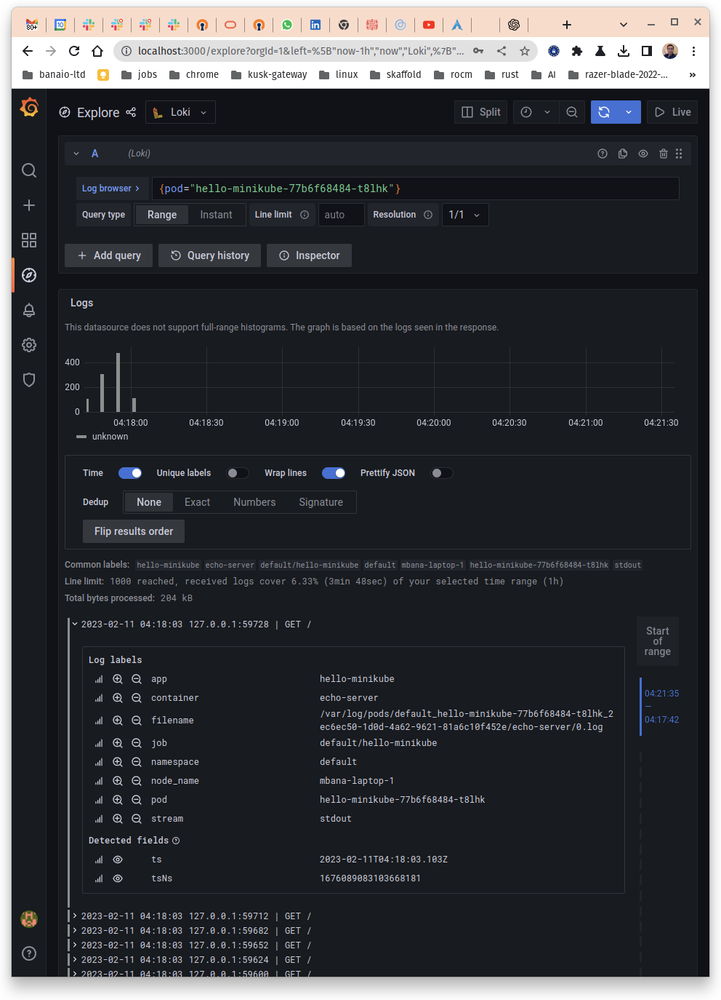

# {{ $frontmatter.title }}

This is an example of how to setup Grafana Loki stack on a Kubernetes cluster.

## Installing Prerequisites

Helm is needed. Below I chose to install it to my local `~/bin` directory as that is my `${PATH}`:

```bash
curl -fsSL --output /tmp/get-helm-3 "https://raw.githubusercontent.com/helm/helm/main/scripts/get-helm-3"
chmod +x /tmp/get-helm-3
mkdir -pv "${HOME}/bin"
HELM_INSTALL_DIR="${HOME}/bin" /tmp/get-helm-3 --no-sudo
rm /tmp/get-helm-3
```

## Add the Grafana repository to Helm

```bash
$ helm repo add grafana https://grafana.github.io/helm-charts
"grafana" has been added to your repositories
$ helm repo update
Hang tight while we grab the latest from your chart repositories...
...Successfully got an update from the "grafana" chart repository
Update Complete. ⎈Happy Helming!⎈
```

## Deploy it to the cluster

**Note:** I have deployed it to the `monitoring` namespace:

```bash
$ helm install --create-namespace --namespace monitoring loki grafana/loki-stack --set filebeat.enabled=true,logstash.enabled=true,promtail.enabled=true --set fluent-bit.enabled=true,promtail.enabled=true --set grafana.enabled=true
NAME: loki
LAST DEPLOYED: Sat Feb 11 03:32:15 2023
NAMESPACE: monitoring
STATUS: deployed
REVISION: 1
NOTES:
The Loki stack has been deployed to your cluster. Loki can now be added as a datasource in Grafana.

See http://docs.grafana.org/features/datasources/loki/ for more detail.
```

## Test

1. `PASSWORD=$(kubectl get secret --namespace monitoring loki-grafana -o jsonpath="{.data.admin-password}" | base64 --decode ; echo); echo "${PASSWORD}"`. This command should give you the password required in step 3.
2. `kubectl port-forward --namespace monitoring service/loki-grafana 3000:80`
3. Open <http://localhost:3000>. The username is `admin` and the password is output of running step 1, e.g., `ZGrxcAMPmDN3DpEsAxER7jiraTIVQcyBSGilWqM4`.
4. `kubectl create deployment hello-minikube --image=kicbase/echo-server:1.0`: Create a deployment.
5. `kubectl port-forward --namespace default pods/hello-minikube-77b6f68484-t8lhk 8080:8080`: Port forward to it so we can issue some requests.
6. `curl localhost:8080/`: Make several of these calls, having said that one should be enough.
7. Look at Grafana and you should see something like below:


